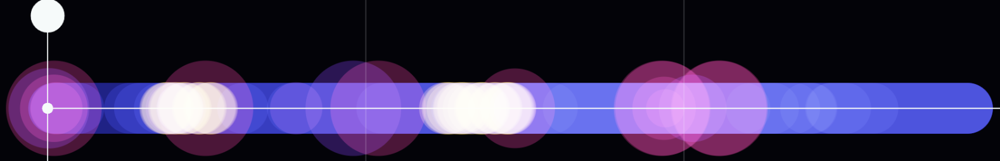
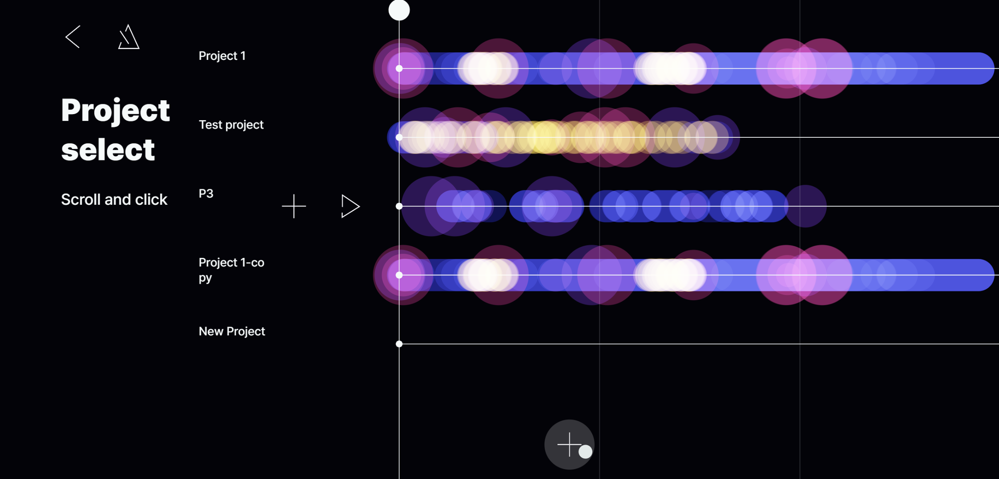
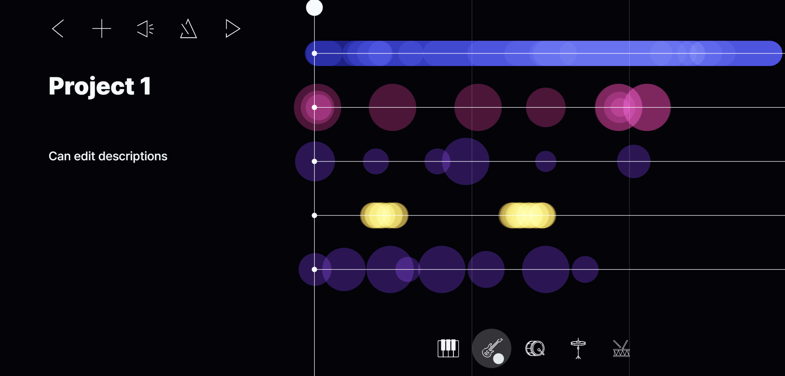
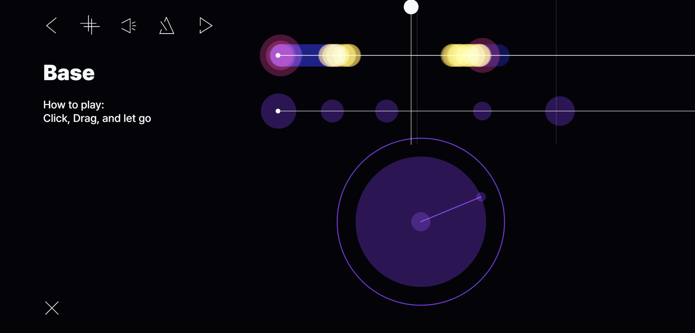
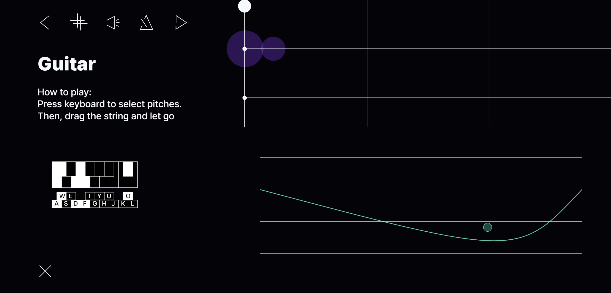
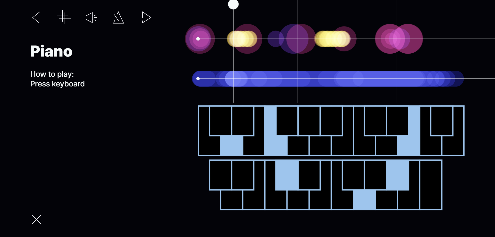
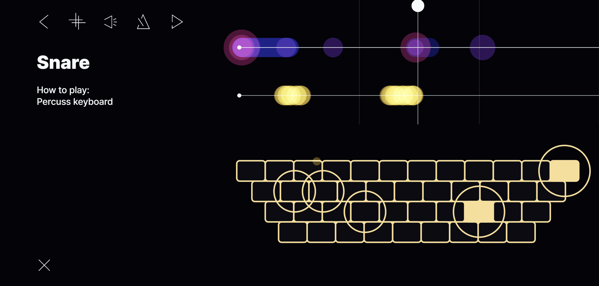
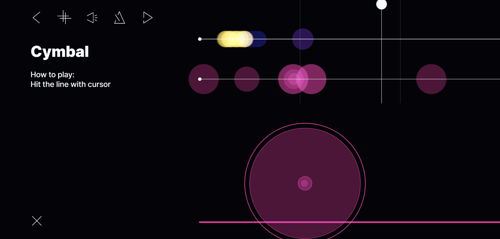

# ANSSEMBLE

**Online repository: [GitHub repo](https://github.com/Cathy-CHS/ID311_FinalProject)**

**Deploy website: [WebApp link](https://id311-finalteam5.web.app/)**

**Demo video: [Video link](https://youtu.be/MIKchVZx5A8)**


- [ANSSEMBLE](#anssemble)
- [Structure \& Switching](#structure--switching)
  - [Common feature](#common-feature)
    - [Common characteristic](#common-characteristic)
    - [Time cursor](#time-cursor)
    - [Playing points](#playing-points)
    - [Buttons](#buttons)
  - [Page switching](#page-switching)
  - [DB page](#db-page)
    - [Functions](#functions)
  - [Project page](#project-page)
    - [Functions](#functions-1)
  - [Layer Page](#layer-page)
    - [Functions](#functions-2)
- [Instrument interactions (layer page)](#instrument-interactions-layer-page)
  - [Base](#base)
  - [Guitar](#guitar)
  - [Piano](#piano)
  - [Snare](#snare)
  - [Cymbal](#cymbal)
- [Challenges](#challenges)

*This is a Github repository for the final course project, ID311 Software Prototyping in 2023 Spring at KAIST.*

**This project, "Anssemble" is a loop station playground.** Players can create short songs by stacking as many layers of instruments as they want. Players can also view other people's projects and modify them to their heart's content. And they can also share their thoughts briefly through the title and description of the project.

Therefore, the title Anssemble is a compound word of Assemble and Ensemble, which means that **player can create a single piece of music by stacking each instrument layer, or creating a non-real-time ensemble with others**.

As we can see from the definition of playground, we aimed for a very light and fun interaction. The accumulation of layers is intuitively and beautifully expressed, and there are unique how to play for each instrument.


# Structure & Switching
The main structure of our code is as follows.

```
Anssemble/
├ src/
│ │ instruments/
│ │ ├ Base.svelte
│ │ ├ Cymbal.svelte
│ │ ├ Guitar.svelte
│ │ ├ Piano.svelte
│ │ └ Snare.svelte
│ ├ layers/
│ │ ├ Layer.svelte
│ │ └ LayerSettings.svelte
│ ├ projects/
│ │ ├ Project.svelte
│ │ └ ProjectSelect.svelte
│ ├ App.svelte
│ ├ Button.svelte
│ ├ Constants.svelte
│ ├ Mainscreen.svelte
│ └ ...
├ public/
│ ├ assets/
│ │ ├ [inst sound files]
│ │ └ [button icons]
│ ├ build/
│ └ ...
└ ...
```
This project uses **svelte**, **p5.js**, **p5.sound**, **p5.play**, and **Firebase**.
Code files are grouped by functions, which are explained as below.
- `src/`
  - `instruments/` : The files receive user input and hold instrument interaction. Each file is assigned to different instrument.
  - `layers/` : Two files in `layers` directory manages layer page and detailed settings, such as button interaction.
  - `projects/` : Two files in `projects` directory shows project list and individual project session.
  - `App.svelte` : It gets database from firebase and executes main function.
  - `Button.svelte` & `Constants.svelte` : Additional button component and constants needed for setting
- `public/` : It saves build information and assets.

## Common feature


### Common characteristic

All projects are based on four bars. The default BPM is designated as 60, and can be done about twice as fast. Our project supports about five instruments which consists of two musical instruments (piano, guitar) and three percussion instruments (base, cymbals, and snare). Each instrument has a distinctive interaction. *(We fixed issues for controlling BPM, which was not properly held in in-class presentation.)*

Player can also access the hidden lines above and below by scrolling the mouse.




### Time cursor
User can view the time cursor on all pages except the title. User can freely move back and forth in time by dragging the circle at the top. In particular, percussion instruments can be played normally while stationary, so it also helps target the exact location.

### Playing points
User can view the time cursor on all pages except the title. User can freely move back and forth in time by dragging the circle at the top. In particular, percussion instruments can be played normally while stationary, so it also helps target the exact location.

### Buttons
The buttons on each page were produced using the Sprite of the **p5.play library**. Here, the button does not mean only a simple circular button, but also most things that are visually toggled, such as a project toggle on the project selection page or a text box on the project page.


## Page switching

Basically, **in order to use p5Play, the instance of p5.js was used instead of p5-svelte.** However, there is no essential difference between p5-svelte and page switching.

```Javascript
...
const dispatch=createEventDispatcher();
...
function projToTot(){
    dispatch('projToTot')
    dispatch('projectTexts', [project_title, project_description])
    p5.remove()
}
...
~~~~~~~~~~~~~~~~~~~~~~~~~~~~~~~~~~~~~~~~~~~~~~~~~~~~~~~
{#if toggle.toggleMain}
        <Mainscreen on:start = {switchtoProject} {width} {height} />
    {:else}
        {#if !(toggle.toggleProject)}
            <ProjectSelect on:project = {projToggle}
            on:projectnum ={projSwitch}
            {width} {height} {database} {projToSee} {NumBar} {user}/>
        {:else if toggle.toggleLayer}
            <div transition:fade>
                <Layer 
                on:layerToProject = {layerToggle}
                on:layerDup={layerDuplicate} 
                on:deleteLayer={layerDelete}
                {width} {height} {layers} {layerToSee} {projToSee} {NumBar}/>
            </div>
        {:else if dupProjectToggle}
            <div transition:fade>
                <Project on:layer = {layerToggle}
                on:projToTot = {projToggle}
                on:projectTexts = {changeDescs}
                on:layernum ={layerSwitch}
                on:projDup = {dupProjectInside}
                {width} {height} {project} {projToSee} {NumBar}/>
            </div>
        {:else if !(toggle.toggleLayer)}
            <div transition:fade>
                <Project on:layer = {layerToggle}
                on:projToTot = {projToggle}
                on:projectTexts = {changeDescs}
                on:layernum ={layerSwitch}
                on:projDup = {dupProjectInside}
                {width} {height} {project} {projToSee} {NumBar}/>
            </div>
        {/if}
    {/if}
```

Basically, switching between pages used a dispatch mechanism. Here, not only the switching of the simple page, but also the data are dispatched to reflect the behavior at a point in time on each page. It was gathered in App.svelte and be processed and resupplied.

Four toggles were used. First of all, there are basic DB-project toggle and project-layer toggle. In addition, there is a toggle that opens when copying a project, as the name suggests, called `dupProjectToggle`. Lastly, to distinguish main screen and project list, `switchToProject` toggle exists.

The reason for this was the project copy function of the Project page, which was to implement the function of transferring the page to the copied project at the same time as the copy.


## DB page


It is a page that can be accessed immediately after the title, and the main function is to select the project you want. The database of the projects are imported from *Realtime Database* of Firebase, which is constantly updated while users add, edit, and delete layers and projects.

### Functions
- (Click project part) Toggle project to open pre-listen/ duplicate icon
  - (When toggled) Can play preview
  - (When toggled) Can duplicate project
    - toggled project automatically change
    - add "-Copy" string in title of project if title size not exceed 25-5 char (max size of Title = 25 chars)
  - (Click once more) Enter Project page
- (Top tool bar) Back to title page, BPM changer
- (Low + button) Add new project, with default format

## Project page

Pages assigned to each loop station. You can add the desired layer or proceed with the operation with layer or prooject itself.

### Functions
- (Top tool bar) Back to Database page, BPM changer
- (Top tool bar) Play song, change Amplitude
- (Top tool bar) Duplicate project itself and change page into that duplicated project page
- (Low instrument buttons) Create empty layer with corresponding instrument
- (Title, Description panel) Hover mouse to toggle
  - (When toggled) Can add chars with keyboard
  - (When toggled) Can modify text with Backspace
- (Click each Layer) Enter Layer page


## Layer Page

Interaction with instruments is the main part. 

We intentionally did not include modifying points within a layer because we thought that would be more interesting. (It feels more like one actually playing an instrument. And it was a view to focus on experiencing rather than making pretty music.)
Above all, this approach was possible because the maximum was 16 seconds in only four bars.

### Functions
- (Top tool bar) Back to Project page, BPM changer
- (Top tool bar) Play song, change Amplitude
- (Top tool bar) Duplicate layer itself
- (Low Left button) Can delete layer
- Instrument interaction panel in right-low plane 


# Instrument interactions (layer page)

## Base
Bass drums usually produce the loudest and dullest sound. Therefore, the task load is quite large in terms of interaction, and instead, the visual effect is large.

Basically, Visual que was used to pull and release like a rubber band. First of all, if one hold the mouse, it draws a circle (meaning maximum) that can guess the intensity of playing the instrument, and drag it to make the line connected and the circle inside grow larger. And when user let it go, user get a point on the layer with a poping visual feedback.


## Guitar
The visual elements of the actual guitar and its mechanism were implemented in the p5.js environment.
Press the keyboard with left hand to adjust the pitch and bounce the string to determine the strength, like a real guitar. 

It is possible to pull the string by clicking the string and dragging the mouse. When player release the mouse, an animation, which line bounces up and down and then stops, will be played. 
Depending on how much the string is pulled, if the string is placed further away, it produces a stronger sound and the amplitude of the guitar string animation is even greater.
The player can also select the desired pitch combination with the keyboard, just like holding the guitar's code.

Determine the intensity of the sound by calculating the difference between the position when the mouse is released and the first position. The value is then continuously multiplied by -1/2 to create an animation in which the line shakes.



## Piano
As shown in the screen above, a part of the piano was implemented in the p5.js environment as it is. A region of about 3 octaves from C3 to C6 was implemented. Visually, natural mapping was attempted through a keyboard. In terms of physical interaction, tapping the keyboard was only replaced by a keyboard, and it succeeded in implementing a real-life interaction on web.

It supports simultaneous input through keyboard, and each pitch is stored as an element. These elements can display starting point and length information like a kind of trajectory on the layer.


## Snare
Since snare performance is basically considered very important to have a sense of fast speed, the task load for each input was reduced to maximize this. Simply press the keyboard to take note the dot on the layer.

It's a very simple basic principle, but it can be open to use. Snare Elements all have the same intensity within a layer. However, player can control the intensity by pressing several keys at once. And since It's done on the keyboard, it can also make a very fast beat with 10 fingers.
In terms of visuals, the corresponding key is filled according to the pressing of the key, and the interaction of forming and disappearing circle centered on to give some immersive feature.


## Cymbal
The basic mechanism is derived from the real cymbals. The faster player hit the cymbals, the stronger the sound becomes. Therefore, hitting on the horizontal line with mouse cursor will create a playing point, where the corresponding amplitude changes according to the speed of the mouse.


In the case of visual interaction, during the click/dragging, like the amplitude indicator of the Base, a circle is created which it's size depending on the speed of the cursor. Afterwards, when you virtually hit the line, a large circle appears and disappears in that position momentarily. It visually expresses an intense sound.

```Javascript
    function nowVel(){
        return velMat.reduce((acc, cur) => acc + cur, 0)/velMat.length
    }
    ...
    velTemp = Math.sqrt(Math.pow((p5.mouse.x-tempXY[0]), 2)+Math.pow((p5.mouse.y-tempXY[1]), 2))
    ...
    velMat.pop();
    velMat.unshift(velTemp)
```

Since Discrete differential was used to determine the speed of the cursor, moving average filter was applied to suppress noise and for natural, smooth interaction.

# Challenges
As we described at the top, we mainly used **svelte**, **p5.js**, **p5.sound**, **p5.play**, and **Firebase**. These are main challenges we met and solved.
- To use Sprite, we applied p5.play to our project. However, the problem was p5-svelte does *NOT* support p5.play library. This made us to import p5.js in **instance mode**, instead of using p5-svelte in local.
- As a result, it *restricted* using other functions and libraries(**tone.js, p5GUI**). To solve it, we used **p5.sound** and **p5.play** as alternatives for sound technique and GUI components, respectively. Also, applying methods such as `onMount()` was needed to solve additional conflicts and issues.
- To share and merge codes easliy, we actively used git. Especially, merging individual codes by using **pull request** in GitHub helped a lot. Active learning and applying new features of git was one of our new trials.
